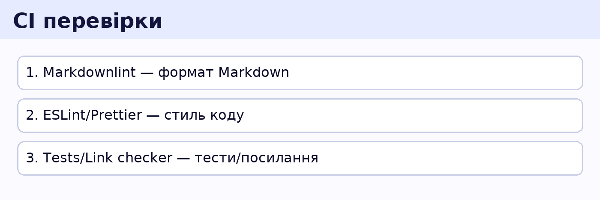

# 🛠 Local Setup (VS Code, Node, Git)

## Рекомендовані інструменти
- **Node.js 20 LTS** (обовʼязково)
- **Git**
- **VS Code** + розширення:
  - ESLint (`dbaeumer.vscode-eslint`)
  - Prettier (`esbenp.prettier-vscode`)
  - Markdownlint (`DavidAnson.vscode-markdownlint`)

## Перевірка встановлення



```bash
node -v  # має бути 20.x
npm -v
git --version
```

## Форматування та стиль
- Проєкт використовує **Prettier** і **ESLint**.  
- Увімкнено `editor.formatOnSave` (див. `.vscode/settings.json`).

## Поради
- Користуйся **integrated terminal** у VS Code.
- Коміти роби маленькими та змістовними.
- README для кожного тижня — must-have: як запускати і що зроблено.
