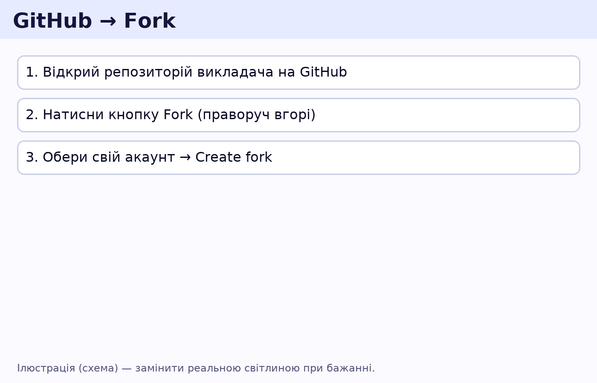
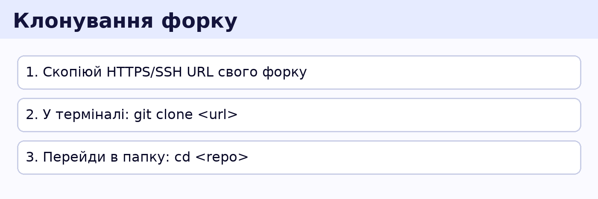
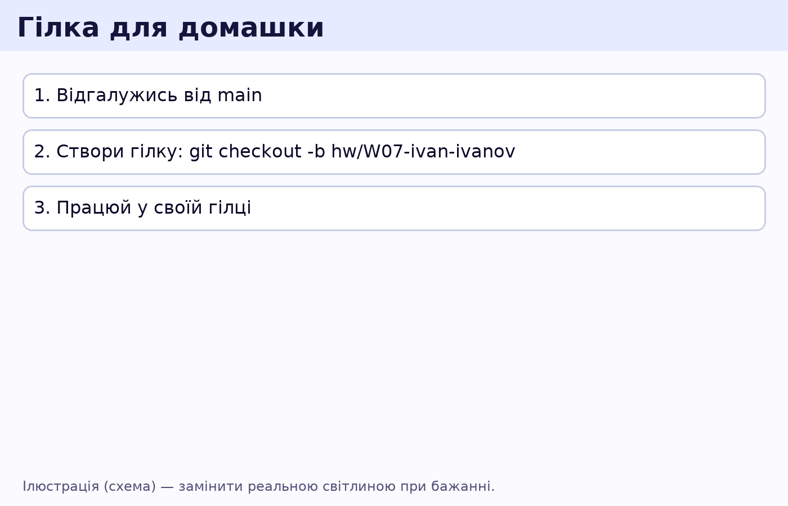
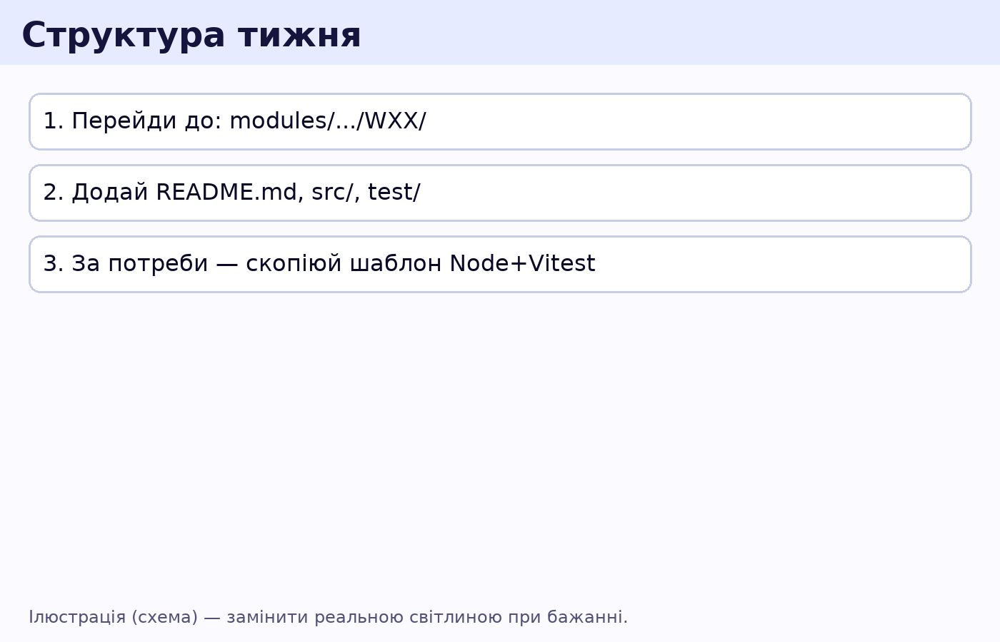
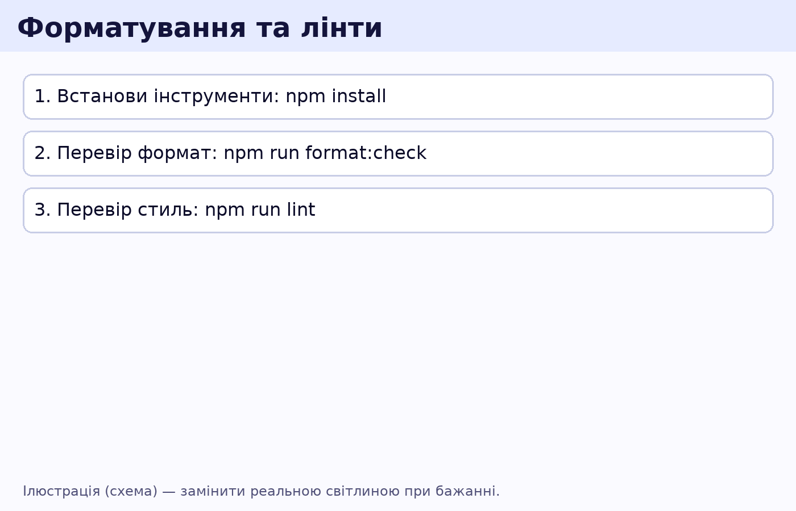
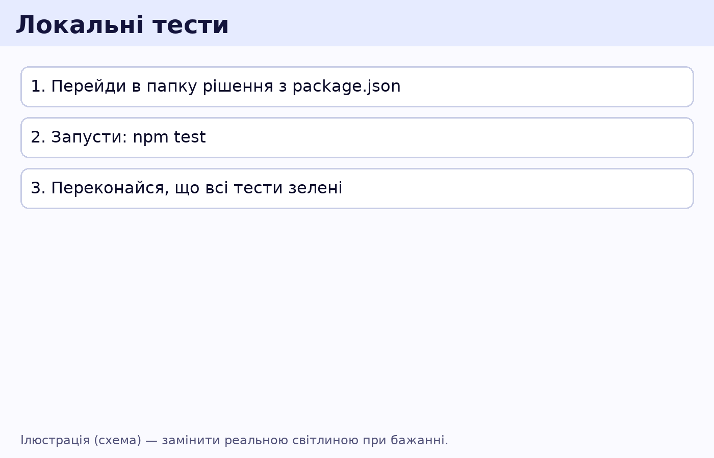
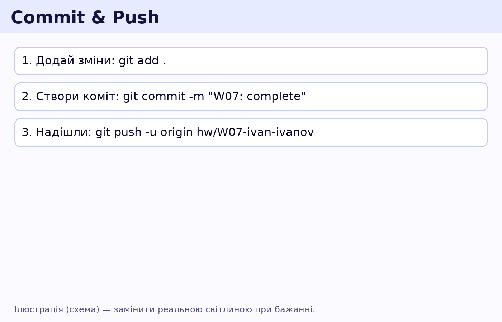
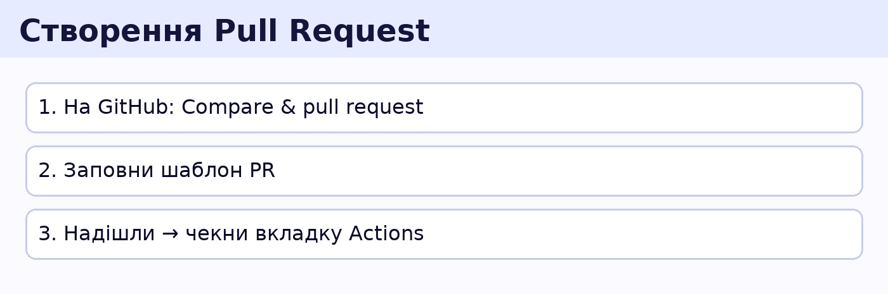
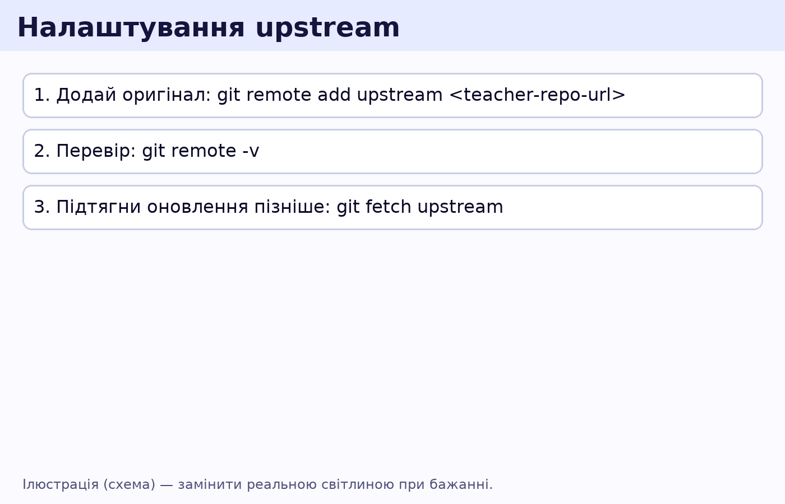

# 👩‍🎓 Швидкий старт: від нуля до першого PR

Цей гайд — покроково для новачків. Пройди його один раз — далі все буде просто.

---

## 0) Вимоги (постав один раз)
- **Git**: перевір, що встановлено
  ```bash
  git --version
  ```
- **Node.js 20 LTS** + npm:
  ```bash
  node -v
  npm -v
  ```
- **VS Code** + розширення: ESLint, Prettier, Markdownlint (репо підкаже, як поставити).

> Якщо чогось бракує — встанови:  
> - Git: https://git-scm.com/downloads  
> - Node 20 LTS: https://nodejs.org/en/download  
> - VS Code: https://code.visualstudio.com/

---

## 1) Зроби Fork курсу



На сторінці репозиторію натисни **Fork** → створиться твоя копія курсу у твоєму акаунті.

---

## 2) Клонуй свій Fork



```bash
# заміни на свою URL
git clone https://github.com/<your-username>/<course-repo>.git
cd <course-repo>
```

Налаштуй посилання на оригінал (щоб підтягувати оновлення):
```bash
git remote add upstream https://github.com/<teacher-username>/<course-repo>.git
git remote -v
```

---

## 3) Створи гілку для домашки



Формат гілки: `hw/WXX-yourname` (WXX — номер тижня).
```bash
git checkout -b hw/W07-ivan-ivanov
```

> Для checkpoint або екзамену використовуй `checkpoint/WXX-...` або `exam/..`.

---

## 4) Знайди свій тиждень і додай матеріали



Перейди в потрібну папку, наприклад для W07:
```
modules/M02-JS-FE/W07/
```
Рекомендована структура всередині тижня:
```
W07/
  README.md          # опиши рішення/як запускати
  src/               # твій код
  package.json       # (за потреби) для тестів та залежностей
  test/              # (за потреби) тести
```

> Можеш скопіювати шаблон **Node + Vitest** з `templates/node-vitest-minimal/` у свою папку тижня, щоб швидко запустити тести.

---

## 5) Форматування та лінти (перевірки стилю)



У корені репо:
```bash
npm install              # встановить ESLint/Prettier для перевірок
npm run format:check     # перевірка форматування
npm run lint             # лінт коду
```
> Якщо хочеш автоматично відформатувати — `npm run format`.

---

## 6) Локальні тести (за бажанням)



Якщо у твоєму тижні є `package.json` і тести (наприклад, на Vitest):
```bash
npm test
```
CI на GitHub теж запустить тести автоматично для PR.

---

## 7) Коміт і пуш



```bash
git add .
git commit -m "W07: complete homework"
git push -u origin hw/W07-ivan-ivanov
```

---

## 8) Створи Pull Request



На сторінці твого форку GitHub запропонує **Compare & pull request**.
- Заповни шаблон PR.
- Дочекайся перевірок (CI) та ревʼю.
- Виправ коментарі, допуш зміни → PR оновиться автоматично.

> Гілки `hw/WXX-*` автоматично отримують label **homework**.  
> Зміни в папках модулів отримають label `module: ...`.

---

## 9) Оновлення курсу у твоєму Fork



Час від часу в оригіналі зʼявляються оновлення. Підтяни їх:
```bash
git checkout main
git fetch upstream
git merge upstream/main
git push origin main
```
Потім відгалужуй нові гілки з актуального `main`.

---

## 10) Часті помилки
- **CI впав через Markdown** — виправ форматування, переглянь лог `markdownlint` у вкладці Actions.
- **Лінки зламані** — перевір повідомлення `lychee` (лінкчекер).
- **ESLint лається** — відкрий помилки в терміналі або в VS Code (розширення ESLint підсвітить).
- **Конфлікти при merge** — зроби `git pull --rebase` або попроси ментора допомогти.

Успіхів! 🚀
