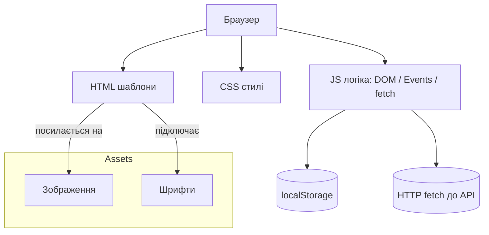
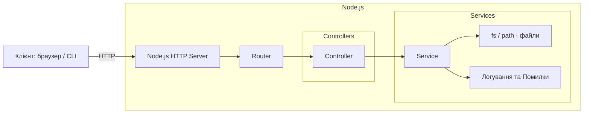
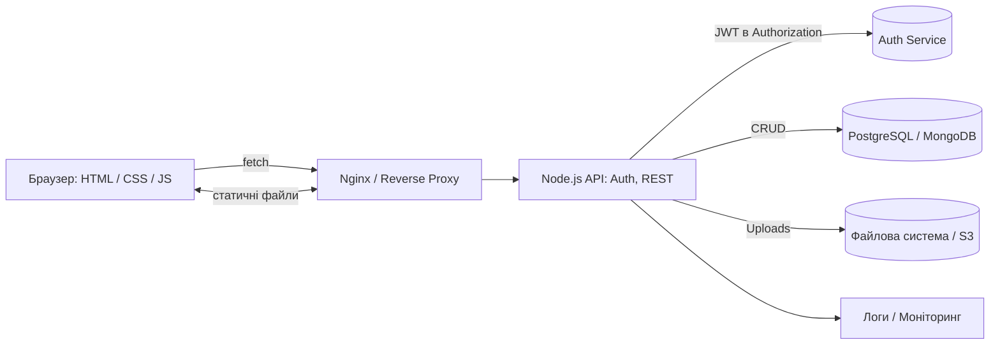
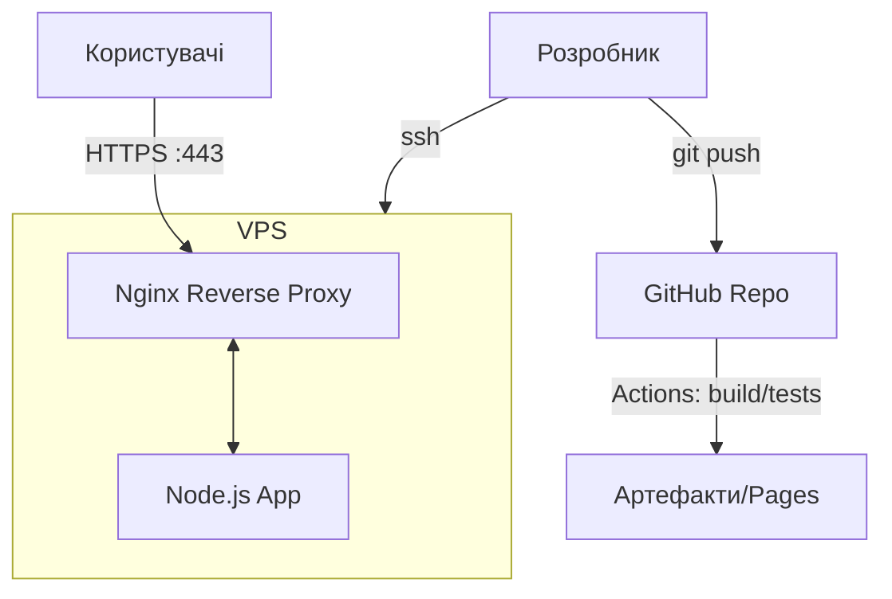

# 🏗️ Архітектура навчальних проєктів (Mermaid)

## 1) Front-end (HTML/CSS/JS, без фреймворків)

## 2) Backend на Node.js (без фреймворків)

## 3) Full‑Stack інтеграція (JWT, БД, Uploads)

## 4) Деплой (VPS + Nginx + Node)

