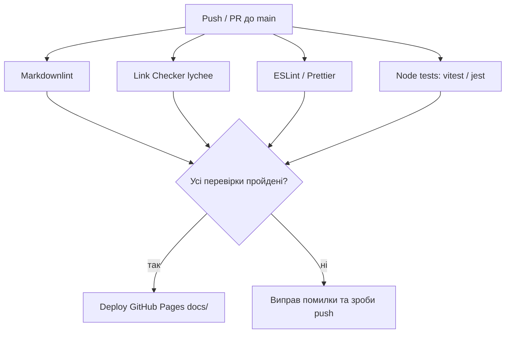

# ⚙️ CI/CD Pipeline у цьому курсі

### Як це впливає на Д/з
- Якщо в папці з рішенням є `package.json` і тести — **CI запустить їх автоматично**.
- Пройти **Markdownlint/ESLint/Prettier** — обовʼязково для "зеленого" PR.
- GitHub Pages деплоїть `docs/` після успішних перевірок.
