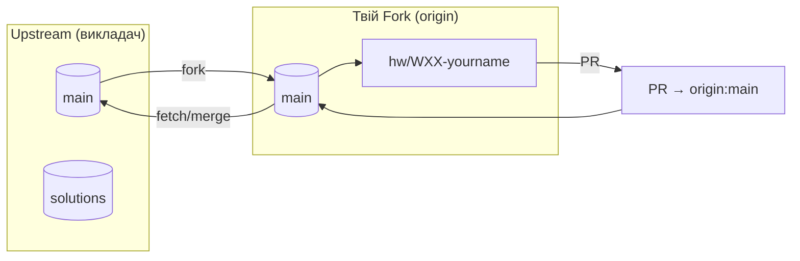
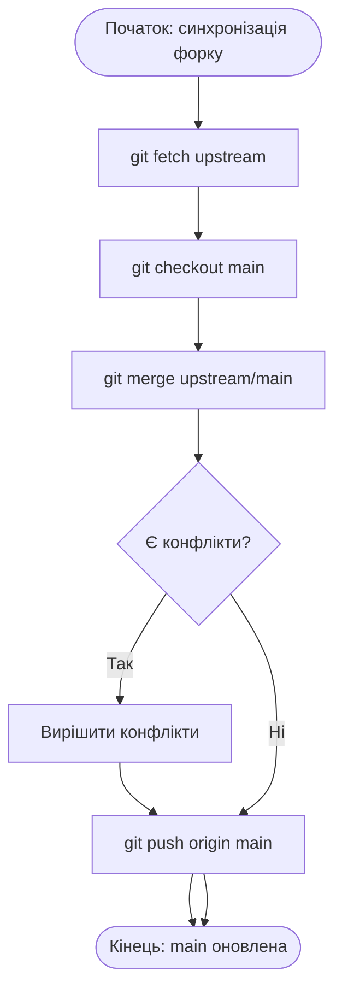

# 🌿 Git-Flow для курсу

## 1) Основний варіант (форк + PR у свій форк)


### Кроки
1. Fork → clone свій форк.
2. Відгалужись: `git checkout -b hw/W07-yourname`.
3. Працюй у `modules/.../W07/`.
4. `git push` і створи **PR у свій форк** (або classroom-репо).
5. Після ревʼю — merge PR у свій `main`.

## 2) Вигрузка оновлень викладача у свій форк


## Корисні команди (шпаргалка)
```bash
# додати upstream один раз
git remote add upstream https://github.com/<teacher>/<repo>.git

# створити гілку для Д/з
git checkout -b hw/W07-yourname

# коміт+пуш
git add . && git commit -m "W07: done" && git push -u origin hw/W07-yourname

# оновити свій main з upstream
git checkout main
git fetch upstream
git merge upstream/main
git push origin main
```

## Позначення гілок
- `main` — матеріали курсу.
- `solutions` — референс рішення (викладач/приватно).
- `hw/WXX-*` — гілки студентів для домашніх.
- `checkpoint/WXX-*`, `exam/*` — контрольні/екзамен.
