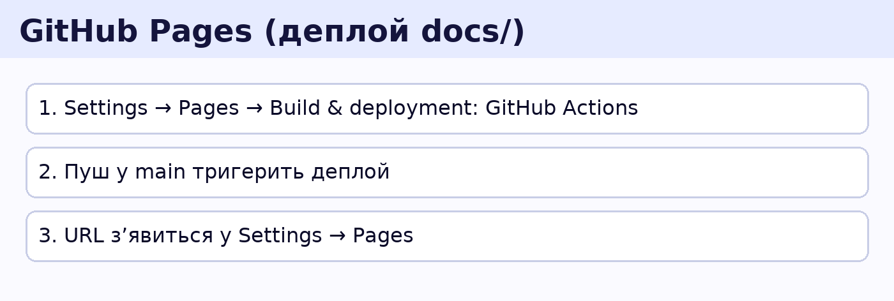

# 📚 Course Docs (GitHub Pages)

Ласкаво просимо! Це швидка навігація матеріалами.

## Модулі
- [Модуль 1 — HTML/CSS](./modules/M01-HTML-CSS/)
- [Модуль 2 — JavaScript (Front-end)](./modules/M02-JS-FE/)
- [Модуль 3 — Node.js Backend](./modules/M03-NodeJS-Backend/)
- [Модуль 4 — Бази даних](./modules/M04-Databases/)
- [Модуль 5 — Full-Stack інтеграція](./modules/M05-FullStack-Integration/)

## Силлабус
- [Огляд програми](./syllabus/overview.md)

- [Classroom Mode](./CLASSROOM.md)

- [Student Quickstart](./STUDENT_GUIDE.md)
- [Local Setup](./LOCAL_SETUP.md)

## Діаграми
- [Архітектура](./diagrams/ARCHITECTURE.md)
- [Git Flow](./diagrams/GIT_FLOW.md)
- [CI/CD Pipeline](./diagrams/CI_PIPELINE.md)
